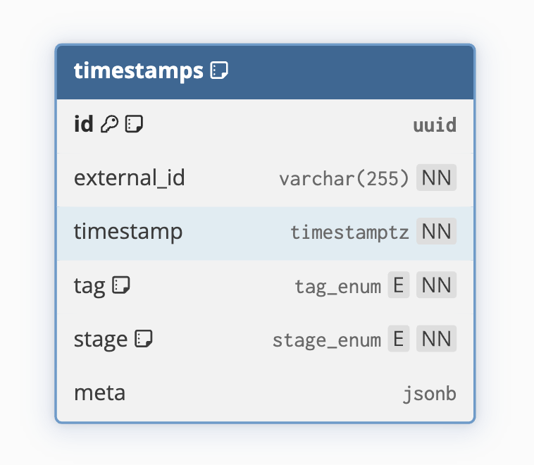
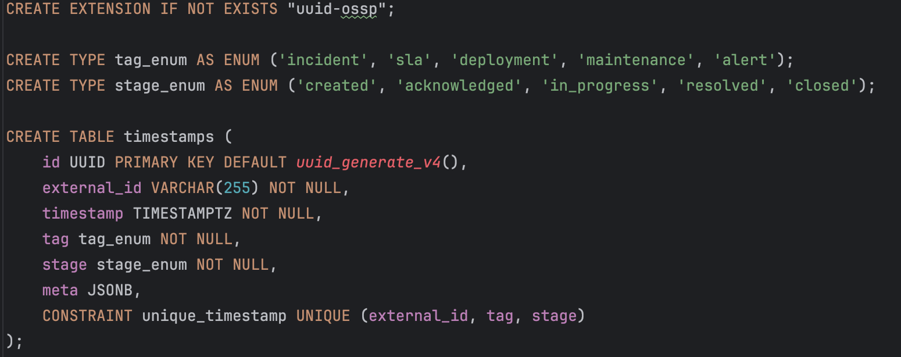

# ⏱️ SLA Timestamp API

## Описание
Это REST API-сервис для управления временными метками SLA (Service Level Agreement). Сервис позволяет создавать, получать, перечислять и удалять записи временных меток событий, таких как инциденты, развертывания и т.д. Используется PostgreSQL для хранения, Redis для кэширования и RabbitMQ для асинхронного обновления кэша для оптимизации операций чтения.

## Ключевые возможности
- **Создание временных меток с обязательными полями (external_id, timestamp, tag, stage) и опциональным meta.**
- **Получение метки по ID.**
- **Перечисление меток с пагинацией и фильтрами (external_id, tag, stage, диапазон timestamp, meta).** 
- **Удаление метки по ID.**
- **Кэширование для ускорения чтения.** 
- **Асинхронная инвалидация кэша через RabbitMQ.** 
- **Валидация, логирование и обработка ошибок.** 
- **Документация API с помощью Swagger.** 
- **Миграции с использованием Goose.** 
- **Покрытие тестами.**

## Технологический стек
- Go 1.21+
- HTTP Framework: Fiber
- Database: PostgreSQL (без ORM, чистый SQL)
- Cache: Redis
- Broker: RabbitMQ
- Validation: go-playground/validator
- Logging: slog
- Migrations: Goose
- Tests: minimock, testify

## Быстрый старт
1. **Клонирование репозитория и подготовка окружения**
  ```bash
    git clone https://github.com/sdvaanyaa/sla-timestamp-api.git
    cd sla-timestamp-api
    cp .env.example .env
  ```
2. **Генерация документации и моков**
- Swagger
  ```bash
  make swagger
  ```
  
- Mocks
  ```bash
  make mocks
  ```
  
3. **Запуск основного API-сервиса (поднимает Docker, прогоняет миграции, линтер и билдит проект)**
  ```bash
  make run
  ```

4. **Запуск consumer-процесса (для обработки событий и асинхронного обновления кэша)**
  ```bash
  make run-consumer
  ```

## Интерфейсы

- 🌐 **API**: [http://localhost:8080](http://localhost:8080)
- 📄 **Swagger-документация**: [http://localhost:8080/swagger/index.html](http://localhost:8080/swagger/index.html)
- 🐰 **RabbitMQ UI**: [http://localhost:15672](http://localhost:15672) (логин: `guest`, пароль: `guest`)


## Схема базы данных


## Схема миграции

